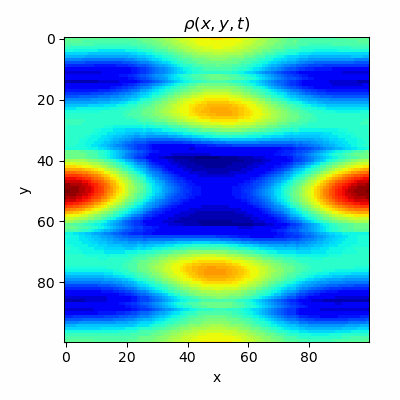
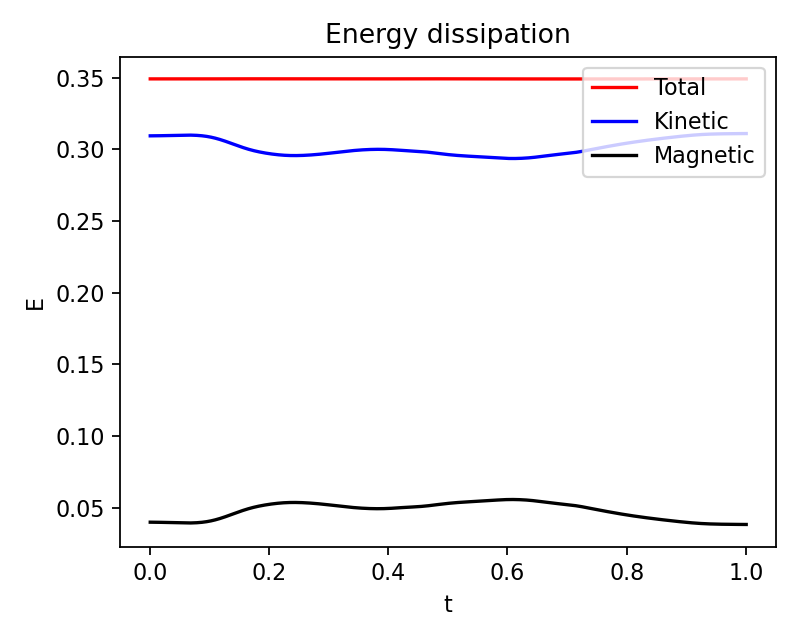

# MHD simulation
## Introduction
This is a github repository for 2-dimensional Magnetohydrodynamic (MHD) simulation for Orszag-Tang vortex. The Orszag-Tang vortex is a supersonic 2D MHD turbulence model problem and is given by the initial condition $B = -sin(y) \hat{x} + sin(2x) \hat{y}$ and $v = -sin(y) \hat{x} + sin(x) \hat{y}$. This condition evolves into highly nonlinear turbulence in 2-dimensional systems. This code simulates the evolution of the MHD turbulence with <a href = "https://en.wikipedia.org/wiki/Finite_volume_method">Finite Volume method </a>. 

<!-- The time integration utilized in this code is <a href = "https://en.wikipedia.org/wiki/Runge%E2%80%93Kutta_methods">explicit Runge-Kunta 4th order method</a>.  -->

<div>
    <p float = 'left'>
        
    </p>
</div>

## Simulation
The below figure represents the simluation result of MHD turbulence. 
<div>
    <p float = 'left'>
        
        
    </p>
</div>

The energy with respect to time given as below figure shows the energy dissipation.

<div>
    <p float = 'left'>
        
    </p>
</div>

## How to execute
```
    python3 main.py --num_mesh {int} --t_end {float} --L {float} --slopelimit {boolean}
                    --use_animation {boolean} --verbose {int} --plot_freq {int} 
                    --savedir {path} --courant_factor {float}
```

## Reference
### Paper
- A fourth-order accurate finite volume method for ideal MHD via upwind constrained transport, Kyle et al., 2018
- Constrained Transport Method for the Finite Volume Evolution Galerkin Schemes with Application in Astrophysics, Katja Baumbach, 2005

### Code
- Philip Mocs: <a href = "https://levelup.gitconnected.com/create-your-own-constrained-transport-magnetohydrodynamics-simulation-with-python-276f787f537d">Constrained transport magnetohydrodynamics simulation, Medium</a>
- Philip Mocz, <a href = "https://github.com/pmocz/finitevolume-python">Create Your Own Finite Volume Fluid Simulation</a>